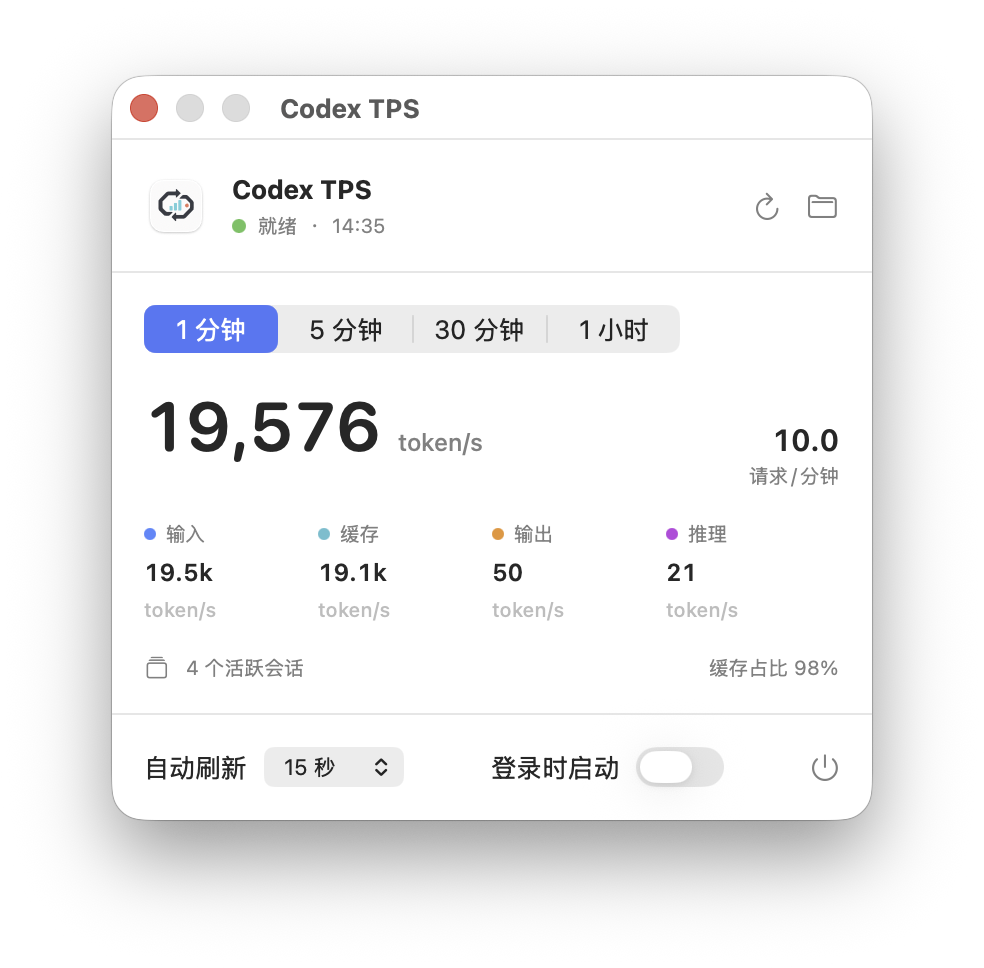

<p align="center">
  
</p>

<h1 align="center">Codex TPS</h1>

<p align="center">
  A private, local-only macOS menu bar monitor for Codex token throughput.
</p>

<p align="center">
  <a href="https://github.com/gaofeng21cn/codex-tps/actions/workflows/ci.yml"></a>
  <a href="https://github.com/gaofeng21cn/codex-tps/releases/latest"></a>
  <a href="LICENSE"></a>
  
</p>

<p align="center">
  <a href="#english">English</a> · <a href="#简体中文">简体中文</a>
</p>



## English

Codex TPS turns the usage events already written by Codex into a compact menu
bar readout. It reads local session logs incrementally, keeps a rolling one-hour
window in memory, and never sends conversation data anywhere.

### Features

- Rolling token rates for `1m`, `5m`, `30m`, and `1h`
- Input, cached-input, output, and reasoning breakdowns
- Requests per minute, active sessions, and cache ratio
- `5s`, `15s`, `30s`, or `1min` auto-refresh cadence
- Manual refresh, session-folder shortcut, and launch at login
- A JSON snapshot CLI for scripts and integrations

The menu bar always shows the rolling one-minute average. Codex records usage
when a model request completes, so the number is completion-time throughput,
not a per-streaming-chunk speedometer.

### Requirements

- macOS 13 Ventura or later
- Codex session logs under `~/.codex/sessions`, or `$CODEX_HOME/sessions`

Codex TPS does not need an API key of its own.

### Quick install

```bash
curl -fsSL https://raw.githubusercontent.com/gaofeng21cn/codex-tps/main/scripts/install-release.sh | bash
```

The installer downloads the latest universal DMG, verifies its published
SHA-256 checksum, installs the app in `/Applications`, and launches it. Use a
per-user destination or skip launch with environment variables:

```bash
curl -fsSL https://raw.githubusercontent.com/gaofeng21cn/codex-tps/main/scripts/install-release.sh | CODEX_TPS_INSTALL_DIR="$HOME/Applications" CODEX_TPS_NO_LAUNCH=1 bash
```

Prefer a graphical install? Download
[`Codex-TPS.dmg`](https://github.com/gaofeng21cn/codex-tps/releases/latest/download/Codex-TPS.dmg)
from the latest release, open it, and drag the app to Applications.

Release builds are ad-hoc signed but not notarized by Apple. When installing the
DMG through Finder, macOS may require the standard right-click **Open** flow or
approval in **System Settings > Privacy & Security**.

### Build from source

Requires Xcode Command Line Tools (`xcode-select --install`).

```bash
git clone https://github.com/gaofeng21cn/codex-tps.git
cd codex-tps
./scripts/install.sh
```

This builds for the current Mac, ad-hoc signs, installs, and launches the app.
To install without launching, pass `--no-launch`. A custom destination is also
supported:

```bash
CODEX_TPS_INSTALL_DIR="$HOME/Applications" ./scripts/install.sh
```

### Metrics

| Metric | Meaning |
| --- | --- |
| `token/s` | `total_tokens` completed inside the selected window, divided by the full window duration |
| Input | Input tokens, including the cached-input subset |
| Cached | Cached input tokens; displayed separately but never added twice |
| Output | Output tokens, including the reasoning subset |
| Reasoning | Reasoning output tokens; displayed separately but never added twice |
| Requests/min | Completed usage events normalized to one minute |

The parser uses `last_token_usage` as the request increment and cumulative
`total_token_usage` to detect duplicate or replayed history. Forked and subagent
sessions are filtered with lifecycle state because inherited history may be
rewritten with the child session's timestamp.

### Privacy and scope

- Reads only structural records needed for usage accounting
- Does not persist or display prompts, responses, or tool-call bodies
- Contains no network client, analytics SDK, account login, or cloud service
- Keeps rolling usage state in memory only

Codex TPS is operational telemetry, not billing data. It reports usage visible
in local Codex logs and cannot prove which API key was charged. Log formats are
an implementation surface and may change in future Codex versions.

### Snapshot CLI

```bash
swift run codex-tps-snapshot --json
```

Set `CODEX_HOME` to inspect a non-default Codex home:

```bash
CODEX_HOME=/path/to/codex-home swift run codex-tps-snapshot --json
```

### Development

```bash
xcrun swift-format lint --recursive Sources Tests Package.swift
swift test
./scripts/build-app.sh
./scripts/build-dmg.sh
```

Architecture and accounting invariants are documented in
[`docs/architecture.md`](docs/architecture.md). Contributions should preserve
the replay fixtures and the no-conversation-content boundary.

### Acknowledgements and disclaimer

The accounting semantics were informed by the public
[Tokscale](https://github.com/junhoyeo/tokscale) project. Codex TPS is an
independent implementation and does not embed Tokscale.

Codex TPS is an unofficial community project. It is not affiliated with,
endorsed by, or sponsored by OpenAI. OpenAI and Codex are trademarks of their
respective owner.

## 简体中文

Codex TPS 是一个仅在本机运行的 macOS 菜单栏小工具。它增量读取 Codex
已经写入 `~/.codex/sessions` 的用量事件，显示最近 `1 分钟 / 5 分钟 /
30 分钟 / 1 小时` 的 token/s，并提供输入、缓存、输出、推理、请求/分钟、
活跃会话和缓存占比等统计。

刷新节奏可选 `5 秒 / 15 秒 / 30 秒 / 1 分钟`，默认 15 秒并会记住上次
选择。菜单栏数字固定为最近 1 分钟平均值。由于 Codex 在一次模型请求完成后
才写入 token 用量，它反映的是完成时吞吐量，不是逐个流式 chunk 的瞬时速度。

### 一键安装

系统要求为 macOS 13 或更高版本。应用本身不需要 API Key。

```bash
curl -fsSL https://raw.githubusercontent.com/gaofeng21cn/codex-tps/main/scripts/install-release.sh | bash
```

安装器会下载 latest release 中同时支持 Apple Silicon 和 Intel Mac 的 DMG，
校验官方发布的 SHA-256，然后安装到 `/Applications` 并启动。也可以直接下载
[`Codex-TPS.dmg`](https://github.com/gaofeng21cn/codex-tps/releases/latest/download/Codex-TPS.dmg)，
打开后将应用拖入 Applications。

Release 使用 ad-hoc 签名，尚未进行 Apple notarization。通过 Finder 安装时，
macOS 可能要求右键选择“打开”，或在“系统设置 > 隐私与安全性”中确认。

### 从源码安装

源码构建需要 Xcode Command Line Tools（`xcode-select --install`）。

```bash
git clone https://github.com/gaofeng21cn/codex-tps.git
cd codex-tps
./scripts/install.sh
```

应用会安装到 `/Applications/Codex TPS.app` 并立即启动。如果 Codex Home 不在
默认位置，可通过 `CODEX_HOME` 指定。

### 隐私与统计边界

- 只解析 token 统计及去重所需的结构记录，不读取或展示对话正文
- 没有网络请求、分析 SDK、登录流程或云端依赖
- 缓存 token 是输入子集，推理 token 是输出子集，不会重复计入总量
- 本机日志统计用于运行观察，不等同于服务端账单，也不能证明具体由哪个 API Key 扣费

### 开发

```bash
swift test
swift run codex-tps-snapshot --json
./scripts/build-app.sh
./scripts/build-dmg.sh
```

项目采用 [MIT License](LICENSE)。这是非官方社区项目，与 OpenAI 不存在隶属、
赞助或背书关系。
