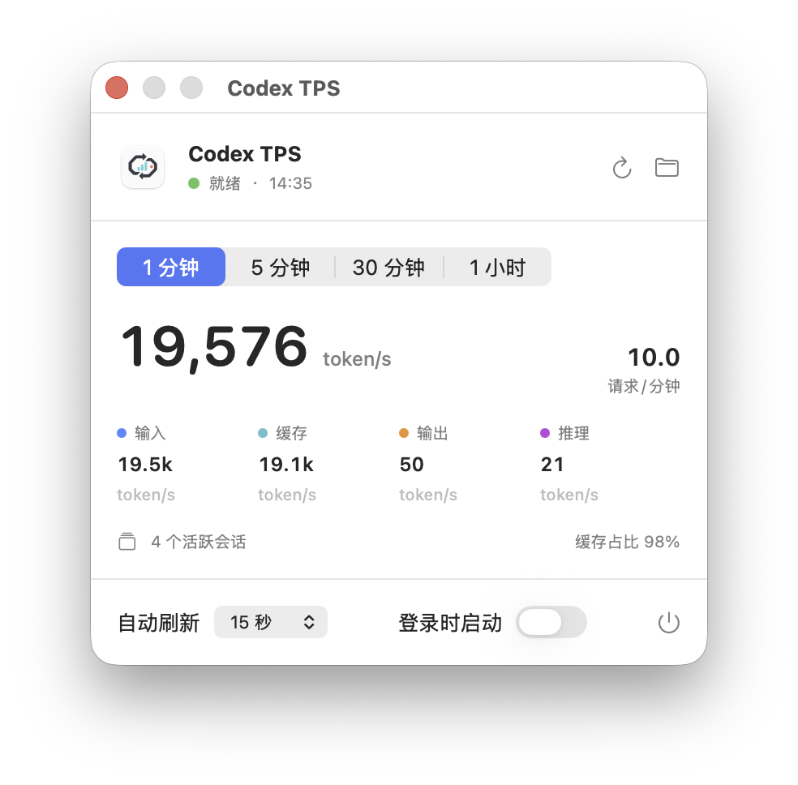

<p align="center">
  
</p>

<h1 align="center">Codex TPS</h1>

<p align="center">
  A privacy-first macOS menu bar monitor for local Codex token throughput.
</p>

<p align="center">
  <a href="https://github.com/gaofeng21cn/codex-tps/actions/workflows/ci.yml"></a>
  <a href="https://github.com/gaofeng21cn/codex-tps/releases/latest"></a>
  <a href="LICENSE"></a>
  
</p>

<p align="center">
  <a href="#english">English</a> · <a href="#简体中文">简体中文</a>
</p>



## English

Codex TPS turns the usage events already written by Codex into a compact menu
bar or system-tray readout. It reads local session logs incrementally, keeps a
rolling one-hour window in memory, and never sends conversation data anywhere.

### Features

- Rolling token rates for `1m`, `5m`, `30m`, and `1h`
- Input, cached-input, output, and reasoning breakdowns
- Requests per minute, active sessions, and cache ratio
- `5s`, `15s`, `30s`, or `1min` auto-refresh cadence
- Manual refresh, session-folder shortcut, and launch at login
- Automatic GitHub release checks and checksum-verified one-click updates
- A JSON snapshot CLI for scripts and integrations
- Opt-in Ambient Ops integration with local-network discovery and aggregate-only pushes

The compact menu bar readout follows the window selected in the panel and
remembers that selection across launches. Codex records usage when a model
request completes, so the number is completion-time throughput, not a
per-streaming-chunk speedometer.

### Requirements

- macOS 13 Ventura or later
- Codex session logs under `~/.codex/sessions`, or `$CODEX_HOME/sessions`

Codex TPS does not need an API key of its own.

### Windows native app

The repository also contains a native .NET 8 WinForms tray implementation for
Windows 11. It reads `%USERPROFILE%\.codex\sessions`, supports an explicit or
WSL UNC `CODEX_HOME`, stores the Ambient Ops token with Windows DPAPI, and
manages optional per-user startup. Download the standard current-user installer
from the latest release:

[`Codex-TPS-Windows-win-x64-Setup.exe`](https://github.com/gaofeng21cn/codex-tps/releases/latest/download/Codex-TPS-Windows-win-x64-Setup.exe)

Build, checksum verification, portable installation and current qualification
boundaries are documented in [`windows/README.md`](windows/README.md). The
Windows installer is not yet Authenticode-signed and may show an
unknown-publisher warning; the macOS DMG remains Developer ID signed and
notarized.

### Quick install

```bash
curl -fsSL https://raw.githubusercontent.com/gaofeng21cn/codex-tps/main/scripts/install-release.sh | bash
```

With Homebrew:

```bash
brew install --cask gaofeng21cn/codex-tps/codex-tps
```

The installer downloads the latest universal DMG, verifies its published
SHA-256 checksum, stages and verifies the app before replacing an existing
installation, then installs it in `/Applications` and launches it. A failed
replacement restores the previous app. Use a per-user destination or skip
launch with environment variables:

```bash
curl -fsSL https://raw.githubusercontent.com/gaofeng21cn/codex-tps/main/scripts/install-release.sh | CODEX_TPS_INSTALL_DIR="$HOME/Applications" CODEX_TPS_NO_LAUNCH=1 bash
```

Prefer a graphical install? Download
[`Codex-TPS.dmg`](https://github.com/gaofeng21cn/codex-tps/releases/latest/download/Codex-TPS.dmg)
from the latest release, open it, and drag the app to Applications.

Release builds are signed with the project's Apple Developer ID and notarized
by Apple. The published DMG carries a stapled notarization ticket and can be
opened normally through Finder without bypassing Gatekeeper.

### Build from source

Requires Xcode Command Line Tools (`xcode-select --install`).

```bash
git clone https://github.com/gaofeng21cn/codex-tps.git
cd codex-tps
./scripts/install.sh
```

This builds for the current Mac, ad-hoc signs, installs, and launches the app.
To install without launching, pass `--no-launch`. A custom destination is also
supported:

```bash
CODEX_TPS_INSTALL_DIR="$HOME/Applications" ./scripts/install.sh
```

### Metrics

| Metric | Meaning |
| --- | --- |
| `token/s` | `total_tokens` completed inside the selected window, divided by the full window duration |
| Input | Input tokens, including the cached-input subset |
| Cached | Cached input tokens; displayed separately but never added twice |
| Output | Output tokens, including the reasoning subset |
| Reasoning | Reasoning output tokens; displayed separately but never added twice |
| Requests/min | Completed usage events normalized to one minute |

The parser uses `last_token_usage` as the request increment and cumulative
`total_token_usage` to detect duplicate or replayed history. Forked and subagent
sessions are filtered with lifecycle state because inherited history may be
rewritten with the child session's timestamp. Legacy UUIDv4 turns inside replay
remain excluded until a verifiable UUIDv7 child turn begins.

### Privacy and scope

- Reads only structural records needed for usage accounting
- Does not persist or display prompts, responses, or tool-call bodies
- Uses the network for GitHub updates and, when Ambient Ops is enabled, for
  local mDNS discovery and aggregate-only pushes to the selected server
- Contains no analytics SDK, account login, or conversation-data upload
- Keeps rolling usage state in memory only

The app checks for a release after launch and every six hours while running. A
new version is installed only after the user clicks **Update now**. The DMG must
match the release's published SHA-256 checksum and expected version before the
installed app is replaced.

Codex TPS is operational telemetry, not billing data. It reports usage visible
in local Codex logs and cannot prove which API key was charged. Log formats are
an implementation surface and may change in future Codex versions.

### Snapshot CLI

```bash
swift run codex-tps-snapshot --json
```

Set `CODEX_HOME` to inspect a non-default Codex home:

```bash
CODEX_HOME=/path/to/codex-home swift run codex-tps-snapshot --json
```

### Ambient Ops agent

The menu bar app can discover `_ambient-ops._tcp.local` automatically. Its
collapsed Ambient Ops settings let you disable integration, switch to a manual
HTTP(S) URL, rediscover the server, and choose the pet reported for this Mac.
With Ambient Ops v0.1.4 or newer, Codex TPS v0.2.10 automatically creates a
per-device P-256 key in the macOS Keychain, opens the local approval page, and
starts signed pushes after the user verifies the six-digit code. The private
key never leaves the Mac, and no shared push token needs to be copied. An
existing token under `cn.gaofeng.ambient-ops.agent-push` remains supported for
older deployments.

The optional headless agent also discovers Ambient Ops automatically when
`CODEX_TPS_AMBIENT_URL` is absent. Set
`CODEX_TPS_AMBIENT_INSTANCE_ID` to prefer one advertised instance. If that
instance rejects or cannot accept a push, the agent tries another compatible
instance found in the same discovery cycle. An explicit URL always overrides
discovery:

```bash
CODEX_TPS_AMBIENT_TOKEN='<agent-token>' \
CODEX_TPS_MACHINE_ID=primary-mac \
CODEX_TPS_MACHINE_NAME='Primary Mac' \
swift run codex-tps-agent
```

```bash
CODEX_TPS_AMBIENT_URL=http://ambient-ops.local:8787 \
CODEX_TPS_AMBIENT_TOKEN='<agent-token>' \
swift run codex-tps-agent --once
```

Instead of putting the token in the environment, set
`CODEX_TPS_AMBIENT_TOKEN_KEYCHAIN_SERVICE` to a generic-password Keychain
service and optionally set `CODEX_TPS_KEYCHAIN_ACCOUNT`. The URL override never
changes token lookup behavior.

The agent sends the stable machine ID in the request path and only these payload
fields: machine name, platform, collection timestamp/status, aggregate `1m` and
`5m` token counters, active-session count, and the optional pet definition and
activity state. Cached input is a subset of input; reasoning output is a subset
of output. Pet fields are `id`, `displayName`, `spriteVersionNumber`,
`assetHash`, `state`, and `stateSince`. Session identifiers, local paths,
prompts, responses, and tool content are never transmitted.

Use `--once` for deployment checks. The default interval is 10 seconds and can
be changed with `CODEX_TPS_PUSH_INTERVAL` (2-300 seconds). Collection failures
retain the last successful aggregate values while reporting an error status;
network failures retry without terminating the collector.

The signed/notarized DMG release contains the menu bar app. The headless agent
remains a source/SwiftPM deployment component and is not installed or started
by the app updater. Publishing a version still requires the repository's
signed, notarized, checksum-verified release workflow; changing the source
version alone does not create a release.

### Development

```bash
xcrun swift-format lint --recursive Sources Tests Package.swift
swift test
./scripts/build-app.sh
./scripts/build-dmg.sh
```

Architecture and accounting invariants are documented in
[`docs/architecture.md`](docs/architecture.md). Contributions should preserve
the replay fixtures and the no-conversation-content boundary.

### Acknowledgements and disclaimer

The accounting semantics were informed by the public
[Tokscale](https://github.com/junhoyeo/tokscale) project. Codex TPS is an
independent implementation and does not embed Tokscale.

Codex TPS is an unofficial community project. It is not affiliated with,
endorsed by, or sponsored by OpenAI. OpenAI and Codex are trademarks of their
respective owner.

## 简体中文

Codex TPS 是一个仅在本机运行的菜单栏/系统托盘工具。它增量读取 Codex
已经写入 sessions 目录的用量事件，显示最近 `1 分钟 / 5 分钟 /
30 分钟 / 1 小时` 的 token/s，并提供输入、缓存、输出、推理、请求/分钟、
活跃会话和缓存占比等统计。

刷新节奏可选 `5 秒 / 15 秒 / 30 秒 / 1 分钟`，默认 15 秒并会记住上次
选择。菜单栏数字会跟随面板当前选择的统计区间，并在重启后保留该选择。由于
Codex 在一次模型请求完成后才写入 token 用量，它反映的是完成时吞吐量，不是
逐个流式 chunk 的瞬时速度。

### Windows 原生版

仓库同时提供基于 .NET 8 WinForms 的 Windows 11 原生托盘版，默认读取
`%USERPROFILE%\.codex\sessions`，也支持显式或 WSL UNC `CODEX_HOME`；
Ambient Ops token 使用 Windows DPAPI 加密保存，并可配置当前用户登录后启动。
可从最新 Release 直接下载标准当前用户安装器：

[`Codex-TPS-Windows-win-x64-Setup.exe`](https://github.com/gaofeng21cn/codex-tps/releases/latest/download/Codex-TPS-Windows-win-x64-Setup.exe)

构建、SHA-256 校验、便携版安装和仍需 Windows 真机验证的边界见
[`windows/README.md`](windows/README.md)。Windows 安装器目前没有
Authenticode 签名，可能显示未知发布者；macOS DMG 仍保持 Developer ID 签名和公证。

### 一键安装

系统要求为 macOS 13 或更高版本。应用本身不需要 API Key。

```bash
curl -fsSL https://raw.githubusercontent.com/gaofeng21cn/codex-tps/main/scripts/install-release.sh | bash
```

使用 Homebrew：

```bash
brew install --cask gaofeng21cn/codex-tps/codex-tps
```

安装器会下载 latest release 中同时支持 Apple Silicon 和 Intel Mac 的 DMG，
校验官方发布的 SHA-256，在目标目录完成暂存和签名校验后原子替换旧版本；失败
会自动回滚。默认安装到 `/Applications` 并启动。也可以直接下载
[`Codex-TPS.dmg`](https://github.com/gaofeng21cn/codex-tps/releases/latest/download/Codex-TPS.dmg)，
打开后将应用拖入 Applications。

应用启动后会自动检查 GitHub latest release，运行期间每 6 小时检查一次；发现
新版本后由用户点击“立即更新”，不会无提示退出或强制更新。也可随时点击面板
顶部的检查更新按钮。

Release 使用项目的 Apple Developer ID 签名并经过 Apple notarization；发布的
DMG 带有 stapled 公证票据，可通过 Finder 正常打开，无需绕过 Gatekeeper。

### 从源码安装

源码构建需要 Xcode Command Line Tools（`xcode-select --install`）。

```bash
git clone https://github.com/gaofeng21cn/codex-tps.git
cd codex-tps
./scripts/install.sh
```

应用会安装到 `/Applications/Codex TPS.app` 并立即启动。如果 Codex Home 不在
默认位置，可通过 `CODEX_HOME` 指定。

### 隐私与统计边界

- 只解析 token 统计及去重所需的结构记录，不读取或展示对话正文
- 网络用于 GitHub 更新；启用 Ambient Ops 后，还会通过局域网 mDNS 自动发现并向选定服务端推送聚合指标
- 没有分析 SDK、登录流程，也不会上传任何会话内容
- 缓存 token 是输入子集，推理 token 是输出子集，不会重复计入总量
- 本机日志统计用于运行观察，不等同于服务端账单，也不能证明具体由哪个 API Key 扣费

### Ambient Ops

菜单栏 App 可以自动发现 `_ambient-ops._tcp.local`。折叠设置中可以关闭集成、
改用手动 HTTP(S) 地址、重新发现服务端，以及选择本机上报的宠物。Codex TPS
`v0.2.10+` 与 Ambient Ops `v0.1.4+` 会自动在 macOS Keychain 生成每台设备
独立的 P-256 私钥，自动打开局域网批准页；核对六位配对码并批准后即可开始签名
推送，不需要复制共享令牌。私钥不会离开本机。已有
`cn.gaofeng.ambient-ops.agent-push` 令牌仍作为旧部署的兼容路径。

Windows `v0.2.9+` 使用相同的一次批准配对协议。Windows 私钥只以当前用户
DPAPI 密文保存在 `settings.json`；macOS 私钥保存在 Keychain；NAS 两种情况
都只保存公钥。无需复制 `agent_push_token`。

headless agent 在没有设置 `CODEX_TPS_AMBIENT_URL` 时同样会自动发现。可用
`CODEX_TPS_AMBIENT_INSTANCE_ID` 指定首选实例；首选端点推送失败后，会尝试同一
轮发现中的其他兼容实例。显式 URL 始终覆盖自动发现：

```bash
CODEX_TPS_AMBIENT_TOKEN='<agent-token>' \
CODEX_TPS_MACHINE_ID=primary-mac \
CODEX_TPS_MACHINE_NAME='Primary Mac' \
swift run codex-tps-agent
```

也可以设置 `CODEX_TPS_AMBIENT_TOKEN_KEYCHAIN_SERVICE`，从 generic-password
Keychain 项读取令牌；`CODEX_TPS_KEYCHAIN_ACCOUNT` 可指定账户。显式 URL
不会改变令牌读取方式。

agent 只在请求路径中使用稳定机器 ID，并发送机器名、平台、采集时间/状态、
`1 分钟 / 5 分钟` 聚合 token 计数、活跃会话数和可选宠物状态。宠物字段只有
`id`、`displayName`、`spriteVersionNumber`、`assetHash`、`state` 和
`stateSince`。会话标识、本机路径、prompt、response 和工具内容都不会发送。

签名/公证的 DMG 只包含菜单栏 App；headless agent 仍通过源码和 SwiftPM
部署，App 更新器不会安装或启动它。修改源码版本不会自动发布，正式 release
仍需完成仓库既有的签名、公证和 checksum 验证流程。

### 开发

```bash
swift test
swift run codex-tps-snapshot --json
CODEX_TPS_AMBIENT_TOKEN='<agent-token>' \
swift run codex-tps-agent --once
./scripts/build-app.sh
./scripts/build-dmg.sh
```

项目采用 [MIT License](LICENSE)。这是非官方社区项目，与 OpenAI 不存在隶属、
赞助或背书关系。
